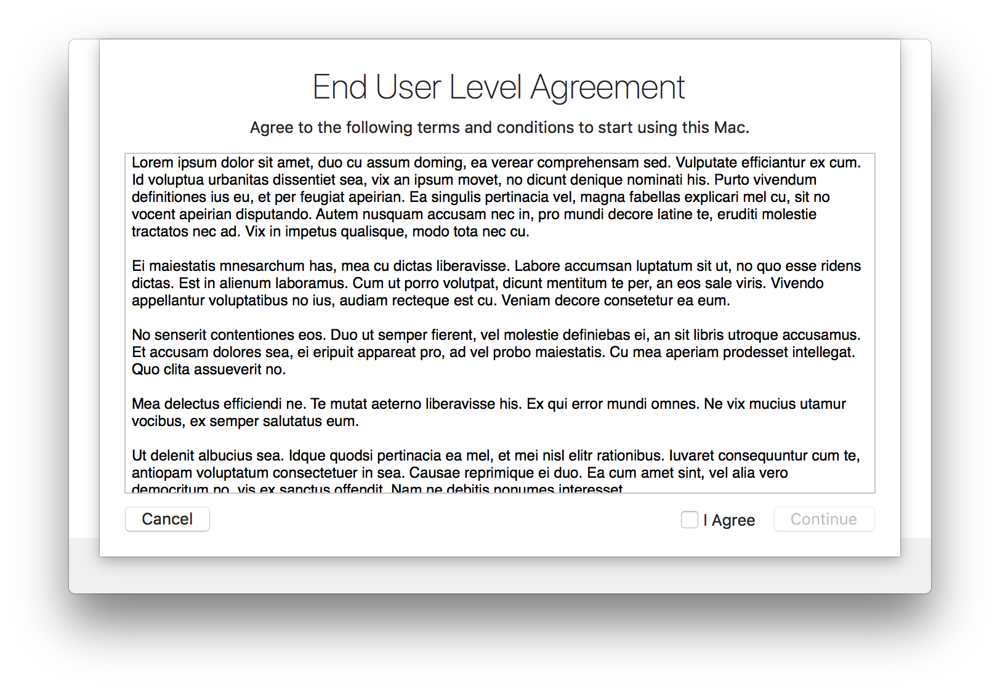
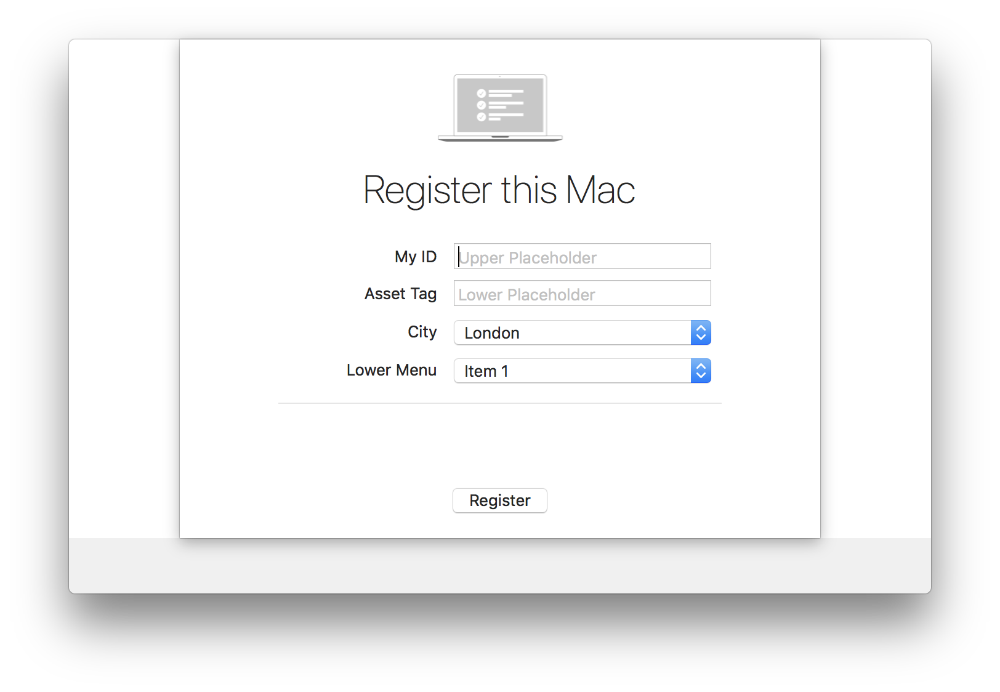

# DEPNotify


DEPNotify is a small light weight notification app that was designed to let your users know what's going on during a DEP enrollment. The app is focused on being very simple to use and easy to deploy.

## Table of Contents

* [**Download**](#download)
* [**Basic Usage**](#basic-usage)
* [**Application Flags**](#application-flags)
* [**Default File Locations**](#default-file-locations)
* [**Commands**](#commands)
* [**Status Updates**](#status-updates)
* [**Registration and EULA Windows**](#registration-and-eula-windows)
* [**Workflow**](#workflow)
* [**Advanced Workflows**](#advanced-workflows)
* [**Changelog**](#changelog)
* [**Notes**](#notes)

## Download

Get the latest version, visit our tags: [DEPNotify tags](https://gitlab.com/Mactroll/DEPNotify/tags)

## Basic Usage

DEPNotify is completely controlled via echoing text to its control file. By default this is `/var/tmp/depnotify.log` but can be changed with the [`-path`](#-path) flag.

The application then reacts to `Command:` and `Status:` lines written to the control file.

## Application Flags

Application flags augment default settings or alert DEPNotify of different management software solutions to pull information from.

#### `-path`
This replaces the default control file located at `/var/tmp/depnotify.log` allowing to select the path with `-path [some path]`.

*Example:* `/Applications/DEPNotify.app/Contents/MacOS/DEPNotify -path /private/tmp/setup.txt`

#### `-fullScreen`
This flag will create a full screen behind the DEPNotify screen to focus the user on the task at hand. By default, DEPNotify launches as a window that can be moved by the end user. Additionally, command-control-x will quit DEPNotify, although this can be modified via the DEPNotify configuration.

*Example:* `/Applications/DEPNotify.app/Contents/MacOS/DEPNotify -fullScreen`

## MDM Specific Flags

#### `-filewave`
This has DEP Notify read in the FileWave log at `/var/log/fwcld.log` and then update the status line in the DEP Notify window with any downloads and installations.

*Example:* `/Applications/DEPNotify.app/Contents/MacOS/DEPNotify -filewave`

#### `-jamf`
This has DEP Notify read in the Jamf log at `/var/log/jamf.log` and then update the status line in the DEP Notify window with any installations or policy executions from the Jamf log. Note there is nothing special you need to name your items in Jamf for them to be read.

*Example:* `/Applications/DEPNotify.app/Contents/MacOS/DEPNotify -jamf`

  * jamf.log will be parsed for the following strings:
    * Downloading *- currently only found when Jamf DEBUG logging is enabled*
    * Installing
    * Successfully installed
    * failed *- when a package fails to install, it will attempt to find the package and reason it failed*
    * Error:
    * FileVault, Encrypt, and Encryption *- if one of these is listed, it will open an "alert sheet" via the **Alert:** command stating:  "FileVault has been enabled on this machine and a reboot will be required to start the encryption process."*
    * DEPNotify Quit *- upon reading, a **Command: Quit:** is issued stating "Setup Complete!" and if FileVault was enabled, it reiterates a reboot is needed.*
      * So, if a policy name contains this string, and executes on the machine, DEPNotify will quit itself.

  * The following strings will be ignored:
    * flat package *- for lines with "downloading flat package"*
    * bom *- for lines with "downloading bom" or "failed to download a bom" file for a package -- only seen when Jamf DEBUG logging is enabled*
    * an Apple package... *- for lines with "Installing an Apple package" -- only seen when Jamf DEBUG logging is enabled*
    * com.jamfsoftware.task.errors *- for lines that display Jamf Errors that we don't want displayed*

  * If you have Prefixes, Postfixes, or other Patterns in your package names, that you do not want displayed to screen, you can add those into the code as well.

#### `-munki`
This has DEP Notify read in the Munki log at `/Library/Managed Installs/Logs/ManagedSoftwareUpdate.log` and then update the status line in the DEP Notify window with any downloads and installations.

*Example:* `/Applications/DEPNotify.app/Contents/MacOS/DEPNotify -munki`

## Default File Locations

* DEPNotify.app: `/Applications/Utilities/DEPNotify.app`
* Configuration and Control File: `/var/tmp/depnotify.log`
* Configuration plist: `/Users/username/Library/Preferences/menu.nomad.DEPNotify.plist`
* EULA and Registration responses: `/Users/Shared/UserInput.plist`
* Completion BOM file: `/var/tmp/com.depnotify.provisioning.done`
* Restart BOM file: `/var/tmp/com.depnotify.provisioning.restart`
* EULA BOM file: `/var/tmp/com.depnotify.agreement.done`
* Registration BOM file: `/var/tmp/com.depnotify.registration.done`
* EULA text file: `/Users/Shared/eula.txt`

## Commands

DEPNotify responds to a number of commands. All are prefaced with `Command:` and then the verb. Most are then followed by some text or other attribute.

### Main Window Configuration

Below are commands that will modify the main window properties, text, or associated images.

#### **Image:**
This will replace the very fancy DEPNotify logo, created by Erik Gomez, with a very fancy image of your own. Note that DEPNotify should scale the image up or down to fit the space.

*Example:* `Command: Image: /tmp/logo.png`

#### **KillCommandFile:**
This command will tell DEPNotify to remove the command file from the filesystem when DEPNotify is quit. Keep in mind file permissions to ensure that the file can actually be removed by DEPNotify.

*Example:* `Command: KillCommandFile:`

#### **MainText:**
This command will change the main body of text in the application.

*Example:* `Command: MainText: Something about how amazing the DEP process you've created is.`
*Example w/ New Lines:* `Command: MainText: Something about how amazing the DEP process you've created is. \n \n It really is amazing.`

#### **MainTextImage:**
This command will change the main body to an icon of your choosing

*Example:* `Command: MainTextImage: /tmp/logo.png`

#### **MainTitle:**
This command will change the main title of text in the application.

*Example:* `Command: MainTitle: Something about how amazing the DEP process you've created is.`

#### **Video:**
Plays a video from a stream or local source. DEPNotify automatically detects if it’s a local or http video. (Video formats accepted .m4v, .mp4, .m3u8)

*Example:* `Command: Video: https://example.com/awesome_video.mp4`  
*Example:* `Command: Video: /var/tmp/awesome_video.mp4`

#### **Website:**
Loads a website in DEPNotify.

*Example:* `Command: Website: https://apple.com`

#### **WindowStyle:**
This command has a few modifiers to it:
    * `Activate` This will force the DEPNotify window to the front of all other windows.
    * `ActivateOnStep` This will force the window to the front for each new progress bar step, so that you don't have to issue the Activate command each time.
    * `NotMovable` This will center the DEPNotify window and make it unable to be moved.

*Example:* `Command: WindowStyle: NotMovable`

#### **WindowTitle:**
This will change the title of the DEPNotify window.

*Example:* `Command: WindowTitle: My Great DEP Notification App`

#### **YouTube:**
Plays a youtube video in DEPNotify.

*Example:* `Command: YouTube: <youtube_id_here>`

### Interaction

Below are commands allow for user interactions like EULA screen or registration screen. There are also commands for modifying the "progress" bar.

#### **ContinueButtonRegister:**
This places a Continue button at the bottom of the screen that that calls the Registration window. Creates a bom file `/var/tmp/com.depnotify.registration.done` on successful completion.

*Example:* `Command: ContinueButtonRegister: <Button Label>`

#### **ContinueButtonEULA:**
This places a Continue button at the bottom of the screen to display a URLA or other agreement you need the user to agree to. Creates a bom file `/var/tmp/com.depnotify.provisioning.done` on successful completion.

*Example:* `Command: ContinueButtonEULA: <Button Label>`

#### **Determinate:**
This makes the progress bar be determinate instead of just a spinny bar. You need to follow this with the number of stages you'd like to have in the bar. Once set, every status update that you send DEPNotify will increment the bar by one stage.

*Example:* `Command: Determinate: 5`

#### **DeterminateManual:**
This makes the progress bar be determinate instead of just a spinny bar. You need to follow this with the number of stages you'd like to have in the bar. Once set, you will need to manually tell DEPNotify when to update instead of relying on status updates or information from the various log files. This allows you to create a progress bar independent of status updates.

*Example:* `Command: DeterminateManual: 5`

#### **DeterminateManualStep:**
When in `DeterminateManual` mode this will advance the progress bar by one step, or by the number following the verb.

*Example:* `Command: DeterminateManualStep: 2`

#### **DeterminateOff:**
Disables a deterministic state for the progress bar. Note that the steps already occurred in the bar will remain, allowing you to move between a deterministic behavior and non-deterministic without loosing your place.

*Example:* `Command: DeterminateOff:`

#### **DeterminateOffReset:**
After turning off the deterministic state of the progress bar, you need to reset it the count to 0.

*Example:* `Command: DeterminateOffReset:`

### Notification

Below are commands for dropdown alerts and notification center alerts for end users.

#### **Alert:**
This creates an alert sheet on the DEPNotify window with an "Ok" button to allow the user to clear the alert. The text that follows the `Alert:` will be the contents to the alert.

*Example:* `Command: Alert: The installation is now finished`

#### **Notification:**
This will issue a notification to the Mac's notification center and display it.

*Example:* `Command: Notification: Please look at this notification.`

#### **NotificationImage:**
This sets an image to use for the user notifications. Keep in mind that this may not be what you are looking for. After setting this notifications will still have the DEP Notify icon in them, but will also have the image set with this command.

*Example:* `Command: NotificationImage: /tmp/image.png`

#### **NotificationOn:**
This will cause all status updates to be sent to the Notification Center as well. It takes no modifiers.

*Example:* `Command: NotificationOn:`

### Completion

Below are commands that can be used to quit, logout, or restart the Mac after workflows are completed.

#### **ContinueButton:**
This places a Continue button at the bottom of the screen that quits DEPNotify. Creates a bom file `/var/tmp/com.depnotify.provisioning.done` on successful completion.

*Example:* `Command: ContinueButton: <Button Label>`

#### **ContinueButtonLogout:**
This places a Continue button at the bottom of the screen that will perform a logout of the Mac. Creates a bom file `/var/tmp/com.depnotify.provisioning.done` on successful completion.

*Example:* `Command: ContinueButtonLogout: <Button Label>`

#### **ContinueButtonRestart:**
This places a Continue button at the bottom of the screen that will perform a soft restart of the Mac. Creates a bom file `/var/tmp/com.depnotify.provisioning.restart` on successful completion.

*Example:* `Command: ContinueButtonRestart: <Button Label>`

#### **Logout:**
This will show a sheet dialog and then log the user out when the "Logout" is clicked. This is commonly used to log the user out and initiate a FileVault encryption process.

*Example:* `Command: Logout: Please logout now to start disk encryption.`

#### **LogoutNow:**
Executes an immediate logout of the user session without waiting until the user responds to the alert  

*Example:* `Command: LogoutNow:`

#### **Quit**
The first of two ways to quit DEPNotify. This option takes no modifiers and will immediately quit the application. Note there is no `:` on this command.

*Example:* `Command: Quit`

#### **Quit:**
The second way to quit the application. This method will allow you to show a dialog with text of your choosing. The user will then be able to dismiss the dialog to quit the application.

*Example:* `Command: Quit: Thanks for using this app.`

#### **QuitKey:**
This will change the default key to quit DEPNotify. By default this is the "x" key with the command and control keys held down. Settign `QuitKey:` allows you to change "x" to any other single character. Note: you are unable to modify the requirement for the command and control keys.

*Example:* `Command: QuitKey: j`

#### **Restart:**
This will cause the machine to begin the restart process. The user will get a notification to accept with the text following the command.

*Example:* `Command: Restart: Your session will end now.`

#### **Restartnow:**
This will cause a restart event without requiring the user to accept.

*Example:* `Command: RestartNow:`

### Deprecated Commands

Below commands have been removed from the product as newer methods have been added.

#### **Help: (deprecated)**

*This command was removed in version X.X.X and changed to a help bubble that is configured by plist.*

This will show a help button in the lower right corner of the DEPNotify window. Pressing the button will open up the path that you specify. Note that this can be both web URLs, such as http://www.apple.com/support, or file paths to local files such as file:///Applications/Chess.app.

*Example:* `Command: Help: http://www.apple.com/support`

## Status Updates

This are very simple. Just echo set `Status:` followed by the text of your status. If you've set `NotificationOn:` the status will also be sent as a notification. Also, if you have `Determinate:` set, each time you send a status the process bar will increment by one.

*Example:* `Status: Reticulating splines...`

## Registration and EULA Windows

You customize the registration and EULA windows using preferences keys. The registration window accepts user input from two text input fields and two pop up menus. You can customize which fields make it to the registration window by setting the fields labels. e.g. if you want to have only one text input field and two pop up menus, just create the keys for the corresponding labels in the preferences file.

You can also set the registration window title and registration button label.

You access defaults key via the defaults command using the `menu.nomad.DEPNotify` domain. This file will be written at `~/Library/Preferences/menu.nomad.DEPNotify.plist`

DEPNotify gets the EULA contents from a text file, see `pathToEULA` below.

When the registration is complete DEPNotify will write the contents of the input to a file named `DEPNotify.plist` in the default path `/Users/Shared/`. This default path can be changed with the `PathToPlistFile` key.

Sample EULA window:


Sample Registration window:


**Keys and Values**

You set the keys using the defaults command:

```bash
defaults write menu.nomad.DEPNotify key value
```

| Key                          | Key    | Comments                                                                                                  | Example Command                                                                         |
|------------------------------|--------|-----------------------------------------------------------------------------------------------------------|-----------------------------------------------------------------------------------------|
| RegisterMainTitle            | String | Sets the main title text on the registration window                                                       | defaults write menu.nomad.DEPNotify RegisterMainTitle 'Register This Mac'               |
| RegisterButtonLabel          | String | Sets the OK button fo the registration window label                                                       | defaults write menu.nomad.DEPNotify RegisterButtonLabel 'Register'                      |
| PathToPlistFile              | String | Sets the path where to save the DEPNotify.plist. Make sure there is always a slash at the end of the path | defaults write menu.nomad.DEPNotify PathToPlistFile '/Users/Shared/'                    |
| UITextFieldUpperPlaceholder  | String | Sets the upper text field placeholder                                                                     | defaults write menu.nomad.DEPNotify UITextFieldUpperPlaceholder 'Upper Placeholder'     |
| UITextFieldLowerPlaceholder  | String | Sets the lower text field placeholder                                                                     | defaults write menu.nomad.DEPNotify UITextFieldLowerPlaceholder 'Lower Placeholder'     |
| UIPopUpMenuUpper             | Array  | Sets the upper pop up menu items array                                                                    | defaults write menu.nomad.DEPNotify UIPopUpMenuUpper -array 'London' 'New York' 'Tokio' |
| UIPopUpMenuLower             | Array  | Sets the lower pop up menu items array                                                                    | defaults write menu.nomad.DEPNotify UIPopUpMenuLower -array 'Item 1' 'Item 2' 'Item 3'  |
| UITextFieldUpperLabel        | String | Sets the upper text input field label                                                                     | defaults write menu.nomad.DEPNotify UITextFieldUpperLabel 'My ID'                       |
| UITextFieldLowerLabel        | String | Sets the lower text input field label                                                                     | defaults write menu.nomad.DEPNotify UITextFieldLowerLabel 'Asset Tag'                   |
| UIPopUpMenuUpperLabel        | String | Sets the upper pop up menu label                                                                          | defaults write menu.nomad.DEPNotify UIPopUpMenuUpperLabel 'City'                        |
| UIPopUpMenuLowerLabel        | String | Sets the lower pop up menu label                                                                          | defaults write menu.nomad.DEPNotify UIPopUpMenuLowerLabel 'Lower Menu'                  |
| pathToEULA                   | String | Set the path to the EULA text file                                                                        | defaults write menu.nomad.DEPNotify pathToEULA "/Users/Shared/eula.txt"                 |
| checkForSensitiveInformation | Bool   | Set visibility of Sensitive Information button                                                            | defaults write menu.nomad.DEPNotify checkForSensitiveInformation -bool true             |
| quitSuccessiveEULA           | Bool   | Set key to quit after EULA accepted and plist written                                                     | defaults write menu.nomad.DEPNotify quitSuccessiveEULA -bool true                       |

## Workflow

While every DEP workflow is different, here's a simple method of using DEPNotify with a DEP process.

* Install DEPNotify as early on as possible during your DEP process
* Install a default command file if you'd like, DEPNotify will read an existing command file at the location you specify and then do those actions all at once. This is helpful for setting the logo and the text.
* Launch DEPNotify. When scripting the opening of DEPNotify, best practice is to use `sudo -u $currentUser open -a /path/to/DEPNotify.app --args -flags`
* As you complete actions for the user write the status updates, or other changes, to the command file. `echo "Command: Quit: The process is now complete." >> /var/tmp/depnotify.log` is one example of doing this.
* Quit DEPNotify when you're done either with `Quit` or `Quit:`
* Remove DEPNotify

## Advanced Workflows

* **Using Filewave argument `-filewave`**
This has DEP Notify read in the Filewave log at /var/log/fwcld.log and then update the status line in the DEPNotify window with any downloads, installs or complete installs from the Filewave log. Progress bar will move depending on how many installs or filesets being deployed. Note there is nothing special you need to name your items in Filewave for them to be read.

* Create LaunchAgent to open DEPNotify with argument `-filewave` (stage1)
* Create LaunchDaemon and script watching for the DEPNotify process to start.
* When the DEPNotify process starts, curl down the Filewave client and install. -create script (stage1)
* **Recommended** - Energy saver profile - Mac’s sleep in 15min out of box, disrupting the DEP process. (stage1)

## Changelog

See [CHANGELOG.md](./CHANGELOG.md)

## Notes

* The application is written entirely in Swift of the course of a few weeks. It should be fairly easy for anyone with basic to moderate knowledge of Swift to enhance this as you see fit.
* DEPNotify was specifically designed to show some notifications to a user while the DEP process completes. The goal was to not block the user from experiencing their new machine. If you would like a more elaborate process, please look at projects like SplashBuddy.
* Comments and feature requests about additional functionality are welcome.
* For information, help and otherwise good times, feel more than welcome to visit the #depnotify channel on the MacAdmins Slack, http://macadmins.slack.com
